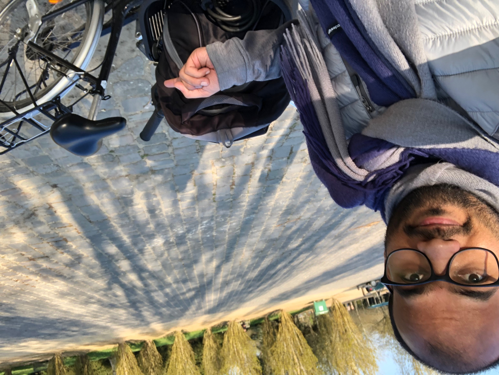
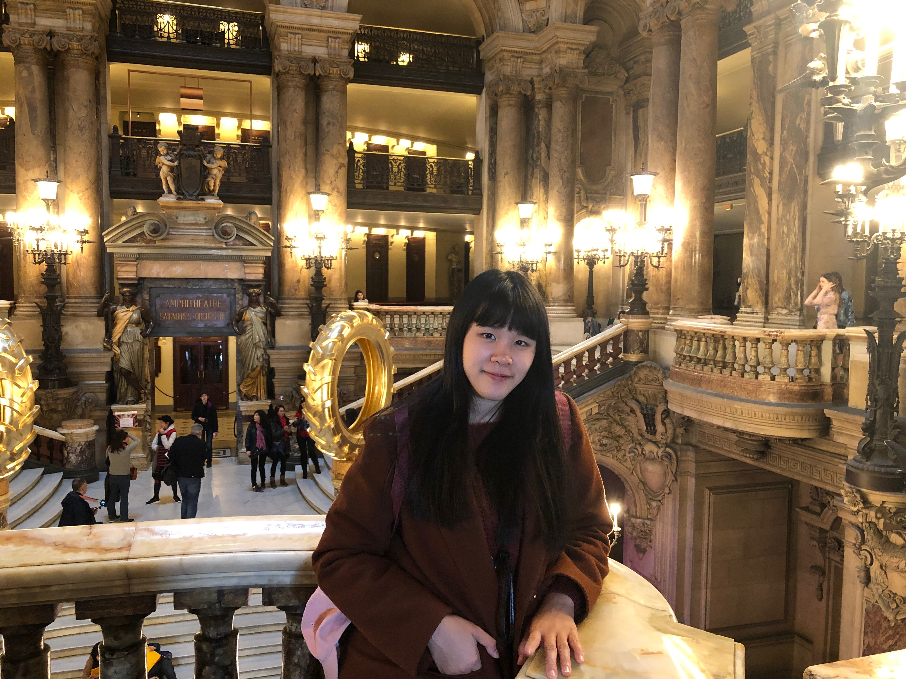
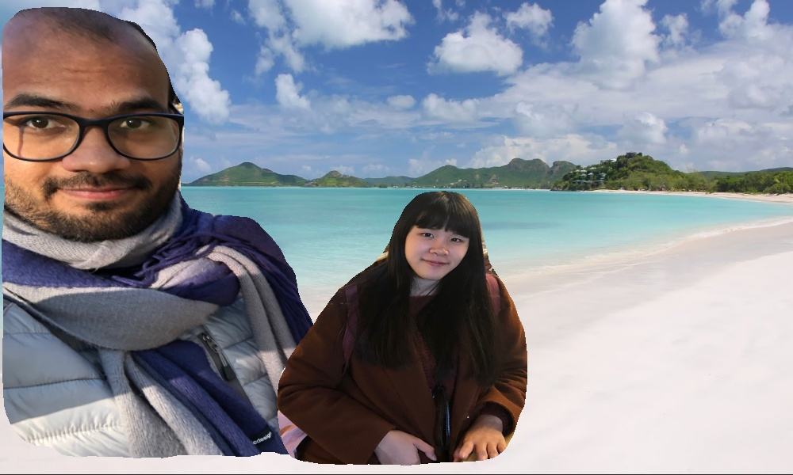
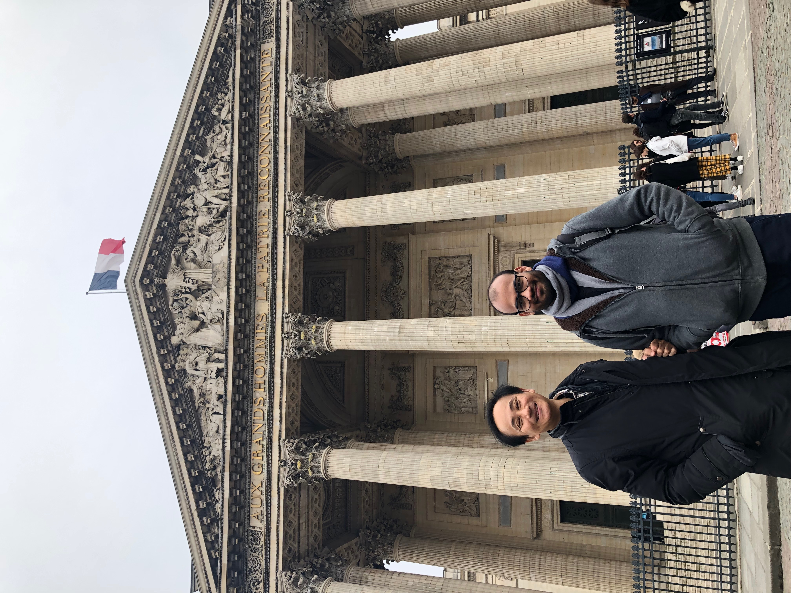
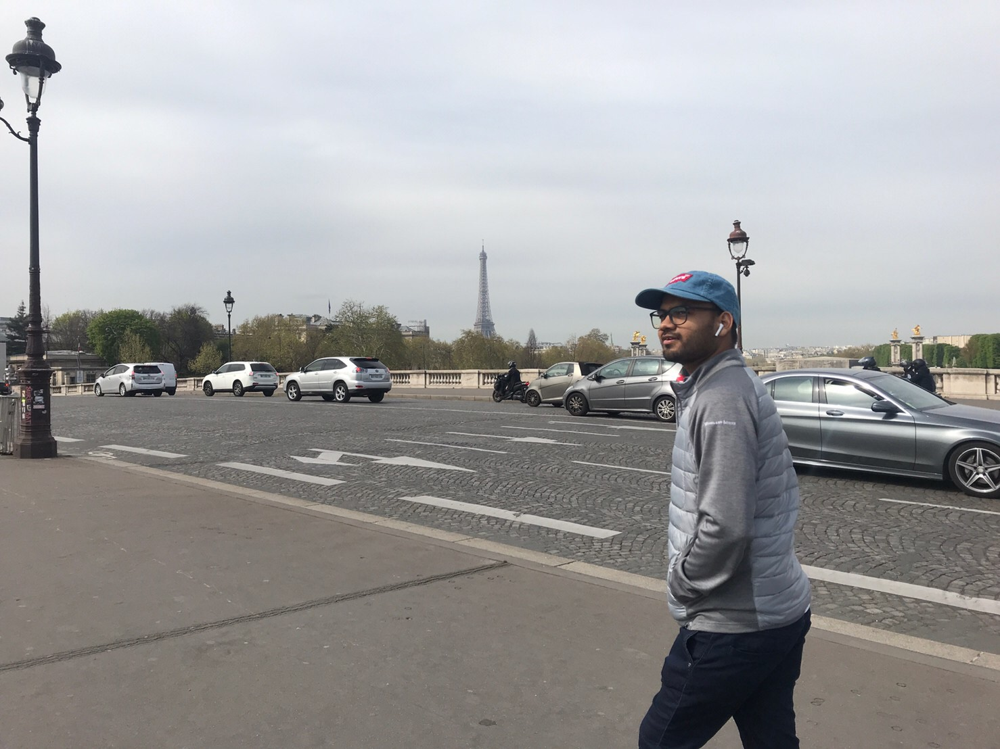
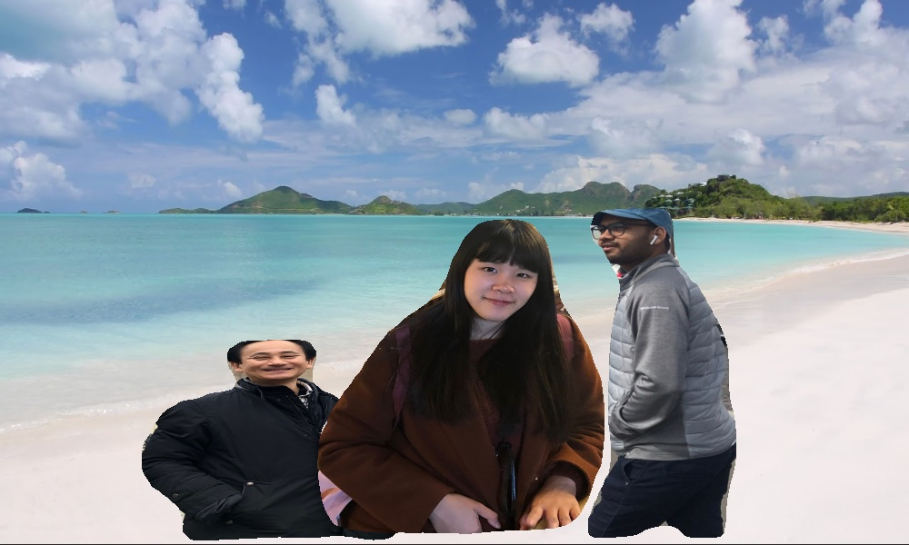
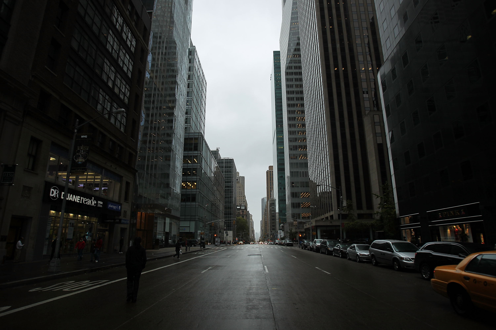
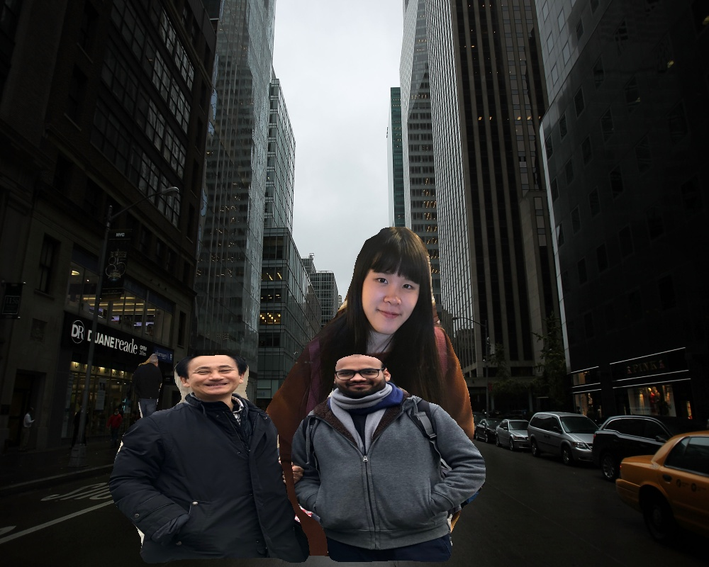

# Extract-and-merge
Extracting the person from different images and merging them together as a single image with new (desired) background - 
Used [MASK R-CNN](https://github.com/matterport/Mask_RCNN) for object detection

  

## Introduction
This project mainly is designed to extract person from different images and merge together as a single image with new background.
In the first stage, objects will be segmented from each input image and only person objects will be considered for further processing.
After that, utilizing the mask information (which pixels belongs to the person-object in the image) recieved using MASK-RCNN, 
new background image pixels will be replaced with object pixels. this process will be reapeted over all input images or videos. 

## Demo

### 2 Input images - 1 person from each image

| Input 1        | Input 2 | Background | Output |
|:-------------:|:-------------:|:-------------:|:-------------:|
|  |  |  |  |

### 3 Input images - 1 person from each image
| Input 1        | Input 2 | Input 3 | Output |
| :-------------: |:-------------:|:-------------: |:-------------:|
| |  |  |  |

### 2 Input images - 2 person from first input and 1 person from second input

| Input 1        | Input 2 | Background | Input 3|
| :-------------: |:-------------:|:-------------:|:-------------:|
|  |  |  |  |

## Highlights
This project is capable to extract single or multiple person from a image. Also, It can handle any number of input images or videos. 
Furthermore, user don't need to worry about the length of videos because if one video is shorter than others then the length of the 
output video will be equal to the longest input video.

## Requirements
numpy

scipy

cython

h5py

Pillow

scikit-image

tensorflow-gpu>=1.3 (Tested on 1.13)

keras

imgaug (It requires shapely to be installed)

opencv-python

## Getting started
Ready the environment by installing all the packges. If you are facing any issues in setting up the environment then you can refer to 
[MASK R-CNN](https://github.com/matterport/Mask_RCNN) page. This project doesn't need any extra packages to run.
Before running, please download mask_rcnn_coco.h5 file
[by clicking here](https://github.com/matterport/Mask_RCNN/releases/download/v2.0/mask_rcnn_coco.h5) 
and put it into the main directory.

Run the 'run_merger.py -h' to know the command line arguments.

### usage: run_merger.py [-h] -l LIST_OF_FILES [LIST_OF_FILES ...] [-v] background_path person

#### 2 Image example - 
run_merger.py demo/background.jpg 2 -l demo/mink_minkesh/IMG-2733.JPG demo/mink_minkesh/IMG_2628.JPG
